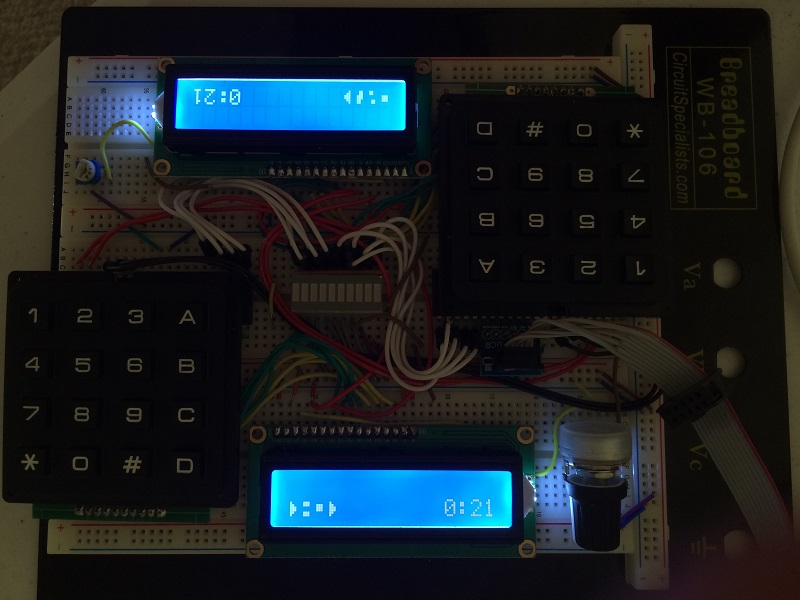

# Codebreakers
Codebreakers is a two player video game built on an embedded system.
Two players compete by being the first to guess a randomly generated string of characters at the start of every game.
However, both players will have opportunities to confuse their opponents during gameplay by inflicting viruses on them.
To excel at this game, one must master concentration, memory, and dexterity!

**Mouse over pictures for a description of it.

   

## How to win
Both players must enter a randomly generated code on their keypad in order to win.
When a player enters a correct character in the right sequence, their side of the LED display will light up in order.
When all 5 LEDS light up on the corresponding player's side, that player will win the game!

    

If an incorrect character in the sequence is inputted, the player's side of the LED display will reset.
This way, both players will eventually be able to correctly input the entire code, given that they can remember the entire combination.

## Viruses (Power Ups)

At the bottom left of both screens, is the Virus String, which is a series of 4 random characters.
If at any point this string changes during the course of a game, any player may enter `**` to obtain a random powerup!
When you obtain a powerup, a letter either `A`, `B`, `C`, or `D` will appear on the top right of your LCD, indicating what type of Virus powerup you just obtained.

To use a Virus on your opponent, simply enter `#` then the letter of the powerup you want to use! (ex. `#A` or `#C`)

The Virus String can change multiple times in one game.

    

Note that if a player tries to grab a Virus but the Virus String has NOT changed, the player's own screen will be frozen for 10 seconds. Not good!

### List of Viruses (Power Ups)

`A`: Attack.   Freezes your opponents keypad for 10 seconds, which means your opponent will be unable to enter in their code, or use a powerup. Multiple Attacks used in short succession will stack!  

  

`B`: Bug.   Flips all the digits on your opponents keypad for 30 seconds.
Which means when your opponent presses a digit on their keypad, it will lead to a different digit. `1` will correspond to `2`, `3` will correspond to `4`, `5` will correspond to `6`, `7` will correspond to `8`, and `9` will correspond to `0`, and vice versa.  

  

`C`: Counter.   Counter is technically not a Virus, but it is used to protect the player from any harmful Viruses that your opponent might send.
The player will be immune to any of your opponents harmful powerups for 20 seconds.
Using this powerup will also remove Bug from your LCD, if necessary, but will not revert an Attack that is already on your LCD, nor will it revert a harmful Disrupt if it has already occured.  

  

`D`: Disrupt.   Will randomly change one digit in your opponents generated code, which means your opponent will have to find the new correct digit for their sequence.
Your opponent will not be notified of this until they find out themselves!
 

## Tips
* Although Viruses are very powerful and can seriously confuse your opponent, it takes a lot of concentration to be able to obtain one without freezing your own screen, which will make you slower at entering the correct code.

* Likewise, completely ignoring the Virus String and only focusing on entering the code may lead you unable to defend yourself from attack!

* Try to strike a good balance between entering in the code, and checking the Virus String for power ups.

* Try to have a system when guessing the code, concentrate on knowing which button presses work for which sequence, instead of guessing blindly until you finnaly input the correct code.

    
